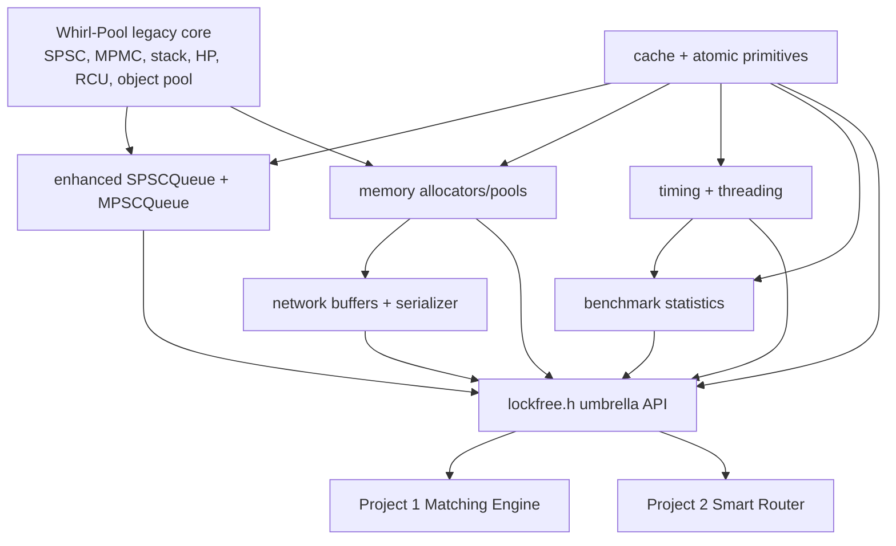

# Extending Whirl-Pool with Low-Latency Infrastructure (Project 3) — Comprehensive Implementation Plan

## 1. Purpose and Definition of Done

Evolve Whirl-Pool itself into a C++17, predominantly header-only low-latency infrastructure library. Add the queue, memory, timing, threading, cache, synchronization, networking, and benchmarking components required by Project 1 (Matching Engine) and Project 2 (Smart Order Router), while preserving existing public APIs where practical and enforcing explicit ownership, bounded memory, predictable latency, and portable fallbacks.

The library is complete when all of the following are true:

- Existing Whirl-Pool structures are retained and enhanced when their semantics can satisfy the new contract without misleading compatibility; incompatible legacy structures remain available and are clearly documented or deprecated before removal.
- A bounded `MPSCQueue` and an enhanced SPSC `SPSCQueue` API support single and batch operations with documented progress, capacity, lifetime, and memory-ordering guarantees.
- Arena, fixed-block, slab, and typed memory-pool APIs perform no implicit heap allocation after construction and provide deterministic exhaustion behavior.
- Timing APIs distinguish monotonic nanoseconds, wall-clock timestamps, and hardware cycles; TSC use is calibrated and rejected or constrained when unsafe.
- CPU affinity, priority, busy polling, and naming return explicit status instead of pretending privileged operations always succeed.
- Cache, prefetch, spinlock, reader-writer lock, and atomic helpers have documented correctness patterns and platform behavior.
- Networking buffers and serializers operate on caller-owned or pool-owned fixed storage, support scatter/gather views, handle endianness and bounds, and never allocate implicitly.
- Histogram, throughput, latency, and jitter tools use bounded storage and clearly state whether recording is thread-local, atomic, exact, or approximate.
- Public headers compile cleanly in C++17 with no RTTI dependency and no required exceptions on supported compilers.
- Unit, compile-contract, property, stress, sanitizer, and integration tests pass on the supported platform matrix.
- Benchmarks publish reproducible distributions and hardware context; performance targets are measured rather than assumed.
- Projects 1 and 2 build against a versioned Whirl-Pool package and pass their queue, pool, serializer, affinity, and timing integration tests.
- README, API reference, memory-ordering notes, integration guides, and benchmark reports are complete and linked.

## 2. Scope, Assumptions, and Non-Goals

### 2.1 Supported scope

- Language baseline: C++17. Projects 1 and 2 may compile as C++20 while consuming this C++17-compatible API.
- Primary performance platform: Linux x86-64 with GCC 10+ or Clang 12+.
- Portability targets: Linux AArch64, macOS, and Windows/MSVC 2019+ where a module has a meaningful native implementation.
- Default cache-line constant: 64 bytes, configurable at compile time. The documentation must note that destructive-interference size is architecture-dependent.
- Primary build form: header-only CMake `INTERFACE` target. A small optional platform library is permitted for code that cannot be implemented safely or cleanly inline.
- All capacities are compile-time parameters or supplied external storage sizes fixed before hot-path use.
- Failure on capacity exhaustion returns `false`, `nullptr`, or a small `Result/ErrorCode`; it never grows storage or throws.
- Hot-path types are nothrow destructible and, where required, nothrow move constructible.
- Projects 1 and 2 consume a version-pinned Whirl-Pool release or commit through its installed CMake package or submodule integration.

### 2.2 Non-goals

- A general-purpose replacement for the C++ standard library or operating-system networking stack.
- Dynamic unbounded containers, transparent fallback to `malloc`, automatic garbage collection, or hidden background threads.
- Universal wait-freedom. Each concurrent structure documents its actual progress guarantee per operation and under full/preemption conditions.
- Automatic system-wide CPU isolation. The library can pin/verify a thread and report host configuration, but boot parameters, cgroups, IRQ placement, and administrator policy remain deployment concerns.
- Calendar/time-zone database functionality on hot paths.
- A universal object serializer based on reflection, RTTI, field discovery, or native struct layout.
- Claiming that every component is faster than its standard alternative under every workload.
- ABI stability for template instantiations. Source/API compatibility follows semantic versioning; generated packages are rebuilt with consumers.

## 3. Required Specification Clarifications

The implementation should record these decisions as Architecture Decision Records before coding.

### 3.1 MPSC progress guarantee

A bounded queue that lets a producer reserve a global ticket with `fetch_add` can contain a reservation hole: if that producer is descheduled before publishing its cell, the consumer cannot skip it without violating FIFO. Therefore the consumer is not wait-free under arbitrary producer preemption.

Implement and document:

- a bounded, sequence-numbered `MPSCQueue<T, Capacity>` optimized for nonblocking producers and one consumer;
- `try_push` with bounded full detection and no overwritten cells;
- `push_wait`/batch reservation using tickets only when waiting is explicitly allowed;
- a single-consumer `try_pop` that is O(1) and wait-free when the next position is either published or unreserved, but may observe/not pass an outstanding reserved hole;
- an optional `MPSCFanIn<T, Producers, LaneCapacity>` built from registered SPSC lanes when strict isolation from a preempted producer is more important than one global FIFO.

Progress claims must use standard terms precisely and be backed by algorithm notes and stress tests.

### 3.2 Arena semantics

“Bump allocator,” “stack-based,” and “LIFO free” are different concepts. Provide:

- a monotonic arena over caller-provided storage, with O(1) aligned allocation and bulk reset;
- `StaticArena<Bytes, Alignment>` whose backing bytes are embedded in the object and may live on the stack;
- markers/rewind for disciplined LIFO region rollback;
- no arbitrary per-object free.

### 3.3 Zero-copy buffer construction

`Buffer(size_t)` cannot guarantee zero heap allocation unless it receives an allocator. Replace it with explicit ownership forms:

- `BufferView`/`MutableBufferView` for borrowed spans;
- `StaticBuffer<Capacity>` for embedded storage;
- `PooledBuffer<Pool>` for a move-only handle borrowed from a fixed pool.

### 3.4 CPU isolation

`CPUAffinity::isolate_core(core_id)` cannot prevent the OS from scheduling work on a core without system configuration and privileges. Replace it with:

- `pin_current_thread(core_id)`;
- `set_current_thread_priority(policy, priority)`;
- `current_cpu()`;
- `verify_isolation(core_id)` returning a diagnostic report;
- documented host setup for `isolcpus`, `nohz_full`, `rcu_nocbs`, cgroups/cpuset, and IRQ affinity.

### 3.5 Performance claims

“All operations <100 ns” and “5–10× faster” are benchmark hypotheses, not universal API guarantees. Gate releases on correctness and reproducibility; publish target results for defined workloads/hardware, including cases where a standard primitive wins.

## 4. Architectural Layers and Dependency Rules



Dependency rules:

- `cache` and low-level `sync/atomic` depend only on the standard library and platform intrinsics.
- `timing` and `threading` may depend on platform adapters but not queues, networking, or benchmarks.
- `memory` extends or remediates Whirl-Pool's object pool but must not depend on networking or benchmarking.
- `queue` is part of Whirl-Pool and depends on cache/atomic helpers.
- `networking` depends on views, fixed memory, and endian helpers; it must not own sockets or perform I/O itself.
- `benchmark` depends on timing/cache primitives but is optional for production consumers.
- The umbrella header includes stable public modules only; consumers can include narrow headers to minimize build time.
- No circular include dependencies and no non-inline definitions in public headers.

## 5. Target Repository and Package Layout

```text
whirl-pool/
├── cmake/
│   ├── whirlpoolConfig.cmake.in
│   ├── CompilerWarnings.cmake
│   └── Sanitizers.cmake
├── docs/
│   ├── adr/
│   ├── api/
│   ├── architecture.md
│   ├── memory-ordering.md
│   ├── platform-support.md
│   ├── project-1-integration.md
│   ├── project-2-integration.md
│   └── benchmarking.md
├── examples/
│   ├── matching_pipeline.cpp
│   ├── router_fanin.cpp
│   ├── pooled_network_buffer.cpp
│   └── latency_measurement.cpp
├── include/
│   ├── lockfree/
│   │   ├── benchmark/
│   │   │   ├── jitter.hpp
│   │   │   ├── latency.hpp
│   │   │   └── throughput.hpp
│   │   ├── cache/
│   │   │   ├── cache_aligned.hpp
│   │   │   ├── padding.hpp
│   │   │   └── prefetch.hpp
│   │   ├── memory/
│   │   │   ├── arena.hpp
│   │   │   ├── fixed_allocator.hpp
│   │   │   └── slab_allocator.hpp
│   │   ├── networking/
│   │   │   ├── buffer.hpp
│   │   │   ├── circular_buffer.hpp
│   │   │   ├── endian.hpp
│   │   │   └── serializer.hpp
│   │   ├── queue/
│   │   │   └── mpsc_queue.hpp
│   │   ├── sync/
│   │   │   ├── atomic.hpp
│   │   │   ├── rw_lock.hpp
│   │   │   └── spinlock.hpp
│   │   ├── threading/
│   │   │   ├── busy_poll.hpp
│   │   │   ├── cpu_affinity.hpp
│   │   │   └── thread_naming.hpp
│   │   ├── timing/
│   │   │   ├── latency_histogram.hpp
│   │   │   ├── timer.hpp
│   │   │   └── timestamp.hpp
│   │   ├── config.hpp
│   │   ├── error.hpp
│   │   ├── version.hpp
│   │   ├── spsc_queue.hpp           # enhanced existing API
│   │   ├── ringbuffer.hpp           # legacy bounded MPMC API
│   │   └── pool.hpp                 # remediated and extended ObjectPool
│   └── lockfree.h
├── src/
│   └── platform/                    # optional non-header platform support
├── tests/
│   ├── compile/
│   ├── unit/
│   ├── property/
│   ├── stress/
│   ├── integration/
│   └── litmus/
├── benchmarks/
│   ├── queue/
│   ├── memory/
│   ├── sync/
│   ├── networking/
│   ├── timing/
│   └── false_sharing/
├── tools/
│   ├── benchmark_report.py
│   └── verify_no_alloc.cpp
├── .github/workflows/
├── CMakeLists.txt
├── CMakePresets.json
├── Doxyfile
├── LICENSE
├── NOTICE
├── README.md
└── CHANGELOG.md
```

## 6. Public API and Coding Conventions

### 6.1 Namespace and target names

- Canonical C++ namespace: `lockfree`.
- In-tree CMake target: `whirlpool`; installed/exported alias: `whirlpool::whirlpool`.
- Optional compiled platform target: `whirlpool_platform`, exported as `whirlpool::platform` and linked transitively when enabled.
- Preserve existing public names where practical. Add functionality directly to the matching Whirl-Pool type or as a narrowly named companion type; deprecate incompatible behavior before removal.
- Version macros/constants follow semantic versioning and are exposed in `version.hpp`.
- `WHIRLPOOL_CACHE_LINE_SIZE` defaults to 64 and must be a nonzero power of two; `lockfree::cache_line_size` is canonical and `CACHE_LINE_SIZE` remains a compatibility name.
- New stable APIs require neither exceptions nor RTTI. Existing throwing or reclamation-sensitive structures remain provisional until their remediation gates pass.

### 6.2 Error model

Define a small trivially copyable status type:

```cpp
enum class ErrorCode : std::uint8_t {
    ok,
    empty,
    full,
    out_of_memory,
    invalid_argument,
    unsupported,
    permission_denied,
    platform_error,
    stale_calibration
};

template<class T>
struct Result {
    T value;
    ErrorCode error;
    constexpr explicit operator bool() const noexcept;
};
```

For the tightest APIs, prefer `bool try_push`, `bool try_pop`, or pointer/null. OS-facing functions return `ErrorCode` plus an optional cold-path native error value. No method silently falls back to heap allocation or a blocking syscall.

`Result<T>` is an allocation-free aggregate. Its explicit Boolean conversion is true exactly when `error == ErrorCode::ok`.

### 6.3 Type requirements

- Publish `static_assert` constraints with actionable messages.
- Queues support trivially copyable values first; nontrivial `T` requires nothrow construction, move, and destruction plus explicit lifetime storage.
- Pools require `T` alignment to be supportable by backing storage and `T` construction to be nothrow in no-exception builds.
- Byte APIs use `std::byte` internally; compatibility overloads may expose `std::uint8_t*`.
- Sizes use `std::size_t`; wire widths use explicit `std::uint*_t` types.

### 6.4 Header-only discipline

- Mark free functions and static data definitions `inline` or `constexpr` as appropriate.
- Avoid anonymous mutable header state and dynamic initialization.
- Platform selection is compile-time with isolated implementation headers.
- No macros leak except documented configuration/version macros.
- The umbrella header is checked in at least two translation units to catch ODR violations.

### 6.5 Documentation on every concurrent API

Each type documents:

- permitted producer/consumer/thread roles;
- ownership and object lifetime;
- linearization point;
- progress guarantee and behavior when full/empty/preempted;
- memory-ordering argument;
- capacity interpretation and usable slots;
- destruction/quiescence requirements;
- exception and allocation behavior;
- platform-specific caveats.

## 7. Current Implementation Audit and Evolution Strategy

### 7.1 Phase 0 audit

Inspect the current Whirl-Pool revision for:

- namespace, target/export names, licenses, and transitive requirements;
- queue capacity semantics, power-of-two restrictions, object lifetime, memory orders, cache layout, batch support, and progress guarantees;
- object-pool address stability, alignment, construction/destruction, thread-safety, ABA defense, capacity, and bulk operations;
- C++17/warning/sanitizer portability and install behavior;
- existing benchmarks and open correctness issues.

This repository is Whirl-Pool itself. Remediate and extend suitable existing types directly instead of adding a second facade, namespace, or package identity. Preserve legacy APIs where practical and require an explicit deprecation path for incompatible changes.

### 7.2 Reuse decision matrix

| Whirl-Pool component | Evolution decision | Acceptance test |
|---|---|---|
| `SPSCQueue` | Retain and enhance directly; keep its existing API | batch/move API, usable-capacity contract, layout, lifetime, TSAN/stress, >100M ops/s target |
| legacy `RingBuffer` | Preserve as the bounded MPMC type; do not repurpose as SPSC | allocation/lifetime/reservation audit and compatibility tests |
| `MPMCQueue` | Preserve as legacy; exclude from bounded hot paths until redesigned | allocation and hazard-reclamation audit |
| `ObjectPool` | Remediate and extend directly | alignment, stable address, batch, exhaustion, constructor failure, double-free and ABA defense |
| Treiber stack/hazard pointers | Keep experimental until reclamation is redesigned | lifecycle/quiescence, cross-instance, stress/litmus and generation/tag audit |
| RCU variants | Keep experimental until reader registration and reclamation are proven | grace-period/thread registration and sanitizer tests |

### 7.3 Package consumption

Whirl-Pool is the library being extended, not a dependency of a second library:

1. in-tree consumers link the `whirlpool` interface target;
2. installed consumers use `find_package(whirlpool CONFIG REQUIRED)` and link `whirlpool::whirlpool`;
3. Projects 1 and 2 may pin Whirl-Pool as a submodule or installed package, but Whirl-Pool never fetches or bundles another copy of itself.

## 8. Queue Module

### 8.1 Bounded MPSC queue layout

Recommended structure:

```cpp
template<class T, std::size_t Capacity>
class MPSCQueue {
    static_assert(is_power_of_two(Capacity));

    struct Cell {
        std::atomic<std::uint64_t> sequence;
        std::aligned_storage_t<sizeof(T), alignof(T)> storage;
    };

    CacheAligned<std::atomic<std::uint64_t>> enqueue_pos_;
    CacheAligned<std::uint64_t> dequeue_pos_; // consumer-owned
    std::array<Cell, Capacity> cells_;
};
```

Algorithm contract:

- Initialize each cell sequence to its slot index.
- A producer reserves a position only after checking the target generation. `try_push` uses compare/exchange on the producer position so a full attempt does not consume an unrecoverable ticket.
- After constructing payload, producer publishes with a release store to `sequence = position + 1`.
- Consumer acquire-loads the expected sequence, moves/destroys payload, then release-stores `sequence = position + Capacity` to open the next generation.
- Use 64-bit monotonically increasing positions; document practical wrap horizon and add reduced-width wrap tests.
- The sequence/generation value prevents a slot from being mistaken for a previous ring cycle; it is the bounded-ring ABA defense.
- `size_approx()` is diagnostic only and not a synchronization primitive.
- Destruction requires producers stopped and queue drained or an explicit `clear_quiescent()`.

### 8.2 MPSC operations

- `bool try_push(const T&)` and `bool try_push(T&&)`.
- `template<class... Args> bool try_emplace(Args&&...)` with nothrow constraints.
- `bool try_pop(T&)` for the single registered consumer.
- `size_t try_push_batch(Input*, size_t)` with documented all-or-prefix semantics; recommended v1 is prefix progress.
- `size_t try_pop_batch(Output*, size_t)`.
- Optional `push_wait` uses `BusyPoll` and is clearly separate from nonblocking `try_push`.
- Optional producer tokens cache metadata only if they do not weaken correctness; benchmark before inclusion.

Batch publication must not expose unconstructed cells. Either publish each cell independently in FIFO order or reserve a safe contiguous range and commit with per-cell release stores. A stalled batch producer must not be represented as wait-free.

### 8.3 Enhanced SPSCQueue

Preserve the existing `SPSCQueue` name and `push`/`pop` operations while adding the stable hot-path API:

```cpp
template<class T, std::size_t Capacity>
class SPSCQueue {
public:
    bool push(const T&);                    // existing compatibility API
    std::optional<T> pop();                 // existing compatibility API
    bool try_push(const T&) noexcept;
    bool try_push(T&&) noexcept;
    bool try_pop(T&) noexcept;
    std::size_t try_push_batch(const T*, std::size_t) noexcept;
    std::size_t try_pop_batch(T*, std::size_t) noexcept;
    std::size_t capacity() const noexcept;
    std::size_t size_approx() const noexcept;
};
```

The current one-empty-slot design has `Capacity - 1` usable positions. Preserve this behavior for the existing template and make `capacity()` report usable capacity; do not silently redefine the template parameter. Enhance the implementation with:

- power-of-two storage and mask;
- producer-owned head and cached tail on one cache line;
- consumer-owned tail and cached head on another cache line;
- release publication and acquire observation, with relaxed owner-local updates;
- fixed storage and explicit object lifetime;
- batch copy/move across at most two contiguous spans.

The existing `lockfree::RingBuffer` remains the legacy bounded MPMC structure. It is not renamed or reused as the SPSC API. New multiple-producer/single-consumer use cases use `MPSCQueue`.

### 8.4 Queue tests

- empty/full, exact capacity, wrap, repeated wrap, batch boundary, partial batch, move-only type, destructor count, and alignment;
- one producer/one consumer ordered millions of sequence values;
- multiple producers with globally unique `(producer_id, sequence)` values: no loss, duplication, corruption, or per-producer reordering;
- producer pause after reservation/publication via test hooks to expose holes and confirm documented behavior;
- reduced counter width to force generation wrap;
- full/empty contention and shutdown/quiescence;
- TSAN, long stress, and memory-order litmus tests on x86-64 and AArch64 where available.

### 8.5 Queue performance gates

- SPSC target: >100 million successful operations/second in a defined one-producer/one-consumer pinned-core benchmark.
- MPSC target: >50 million aggregate successful operations/second for a defined producer count/topology and one pinned consumer.
- Report item size, batch size, ring capacity, producer count, core/NUMA placement, retries, full rate, CPU utilization, latency percentiles, and standard mutex-queue comparison.

## 9. Memory Module

### 9.1 Arena

Provide two forms:

```cpp
class Arena {
public:
    Arena(void* storage, std::size_t bytes) noexcept;
    void* allocate(std::size_t bytes, std::size_t alignment) noexcept;
    Marker mark() const noexcept;
    bool rewind(Marker) noexcept;
    void reset() noexcept;
    std::size_t used() const noexcept;
};

template<std::size_t Bytes, std::size_t Alignment = 64>
class StaticArena;
```

Requirements:

- alignment validated as nonzero power of two;
- overflow-safe round-up and end checks;
- O(1) allocate, mark, rewind, and reset;
- single-thread owner by default; an atomic arena is a distinct type, not hidden overhead;
- no destructor tracking in the raw arena. Provide optional RAII construction helpers that explicitly destroy objects on scope/rewind if needed;
- debug mode can poison reset memory and track high-water mark without changing release ABI.

### 9.2 Fixed allocator

Use a policy-based typed/fixed-block design:

- `FixedAllocator<BlockSize, BlockCount, Alignment, ThreadingPolicy>` owns or receives preallocated storage.
- Intrusive free-list pointers live inside free blocks.
- Single-thread policy has O(1) pop/push with no atomics.
- Concurrent policy uses a tagged index/head or the remediated Whirl-Pool `ObjectPool` free-list primitive to prevent ABA; do not assume pointer spare bits portably.
- `allocate()` returns `nullptr` on exhaustion; `deallocate()` requires a pointer owned by the allocator and exact block alignment.
- Debug builds detect foreign pointers, double free, canaries, and free-list cycles.
- Batch allocate/deallocate returns an explicit count; document all-or-prefix semantics.

### 9.3 Slab allocator

- Fixed size classes: 8, 16, 32, 64, 128, 256, 512, 1024 bytes.
- O(1) class selection via bit width/leading-zero operation with portable fallback.
- Each class uses a preallocated fixed allocator with compile-time block count and alignment.
- Requests above 1024 or above supported alignment return `nullptr`/`unsupported`; never fall back to heap.
- Deallocation must know the class safely. Recommended API is `deallocate(ptr, original_size)` with ownership validation; an alternative typed handle may store class ID. Avoid hidden per-allocation headers unless their overhead is explicitly accepted.
- Define behavior for zero-byte allocations (recommended: return `nullptr` and `invalid_argument`).
- Expose per-class capacity, used, high-water, and failure counters on a cold diagnostic path.

### 9.4 ObjectPool remediation and extension

Preserve `ObjectPool<T, Count>` and its move-only `PooledPtr` ownership model, then extend it directly:

```cpp
template<class T, std::size_t Count,
         std::size_t Alignment = alignof(T)>
class ObjectPool {
public:
    auto acquire() noexcept; // existing compatibility API
    template<class... Args> auto try_acquire(Args&&...) noexcept;
    std::size_t try_acquire_batch(
        PooledPtr<T, Count>* out, std::size_t count) noexcept;
    std::size_t release_batch(
        PooledPtr<T, Count>* items, std::size_t count) noexcept;
};
```

- Begin object lifetime correctly for every internal block and use aligned allocation or embedded aligned storage appropriate to `Alignment`.
- Replace the untagged pointer free list with a tagged index/head or another reclamation-safe bounded design that prevents ABA.
- Support `Alignment >= alignof(T)` and cache-line-aligned objects without wasting undocumented extra slots.
- Separate raw slot acquisition from object construction internally so a failed constructor cannot corrupt the free list. In no-exception builds, require nothrow construction.
- Keep raw release internals private so foreign pointer/block pairs cannot be injected through the public API.
- Define whether concurrent acquire/release is lock-free based on the remediated implementation; do not upgrade claims through naming alone.
- Batch operations preserve each object's construction/destruction exactly once.

### 9.5 Memory tests and benchmarks

Tests:

- every alignment and boundary, exact exhaustion/reuse, marker/rewind, overflow, zero/oversized request;
- constructor/destructor counts, over-aligned types, move-only types, partial batch;
- double free/foreign pointer detection in debug mode;
- concurrent free-list stress, ABA-focused reduced tag tests, and TSAN;
- no calls to global `new/delete/malloc/free` after storage initialization via interposition hooks.

Benchmarks:

- arena versus monotonic `malloc`/`new` workload and `std::pmr::monotonic_buffer_resource` where available;
- fixed/slab/pool versus `malloc/free`, `new/delete`, and an appropriate standard/PMR baseline;
- single and batch operations, hot/cold cache, exhaustion, varied object sizes, single-thread and contention;
- target 5–10× improvement only on named relevant workloads, with bytes reserved and fragmentation reported.

## 10. Timing Module

### 10.1 Clock taxonomy

Expose distinct types/functions so users cannot confuse domains:

- `MonotonicClock::now_ns()` for intervals and deadlines;
- `CycleClock::now()` for hardware cycles;
- `WallClock::now_unix_ns()` for audit/log timestamps;
- `TscCalibration` for cycles-to-nanoseconds conversion on supported x86-64 hosts.

Do not define one ambiguous `HighResTimer::now()` that changes semantic domain by platform without documentation. A compatibility facade may provide the requested names while delegating explicitly.

### 10.2 Cycle clock

On x86-64:

- detect invariant/nonstop TSC through CPUID where supported;
- use a documented serialization choice (`lfence; rdtsc` for start and `rdtscp; lfence` for end, or equivalent) depending on measurement semantics;
- return raw cycles without converting on the hot path;
- calibrate against `CLOCK_MONOTONIC_RAW` over multiple windows, reject unstable samples, record calibration age/error, and optionally pin during calibration;
- document migration risk and prefer pinned threads for cycle deltas.

On non-x86:

- use an architecture counter only when a safe user-accessible implementation exists;
- otherwise return `unsupported` for cycles and use monotonic nanoseconds.

### 10.3 Monotonic and wall clocks

- Linux interval clock: `clock_gettime(CLOCK_MONOTONIC_RAW)` or vDSO-backed monotonic selection, benchmarked and documented.
- Wall clock: `CLOCK_REALTIME`/platform equivalent; it may jump and must never drive timeouts.
- Timestamp arithmetic uses checked unsigned deltas.
- Time-of-day formatting is a cold-path helper that writes into caller-provided fixed storage; no locale allocation on hot paths.

### 10.4 Latency histogram

Provide two explicit variants:

- `LocalLatencyHistogram<MaxNs, BucketCount>`: non-atomic counters, one writer, mergeable; recommended for per-thread hot paths.
- `AtomicLatencyHistogram<MaxNs, BucketCount>`: relaxed atomic counters, multiple writers; higher recording cost.

Contract:

- O(1) record using fixed-width linear, logarithmic, or hybrid compile-time bucket mapping;
- overflow bucket for values above maximum and counter for invalid/saturated samples;
- exact `min/max/count/sum` where widths permit, approximate percentile bounded by bucket resolution;
- percentile scan is O(BucketCount), intended for cold snapshots, not the recording path;
- percentile input validation and integer forms (`percentile_bps(9990)`) to avoid floating-point ambiguity on hot/cross-platform code;
- merge requires matching histogram configuration and yields deterministic buckets.

### 10.5 Timing tests

- monotonicity, nonnegative deltas, conversion overflow, calibration expiry, unsupported fallback;
- histogram bucket boundaries, overflow, empty, one sample, known distributions, percentile error bounds, merge equivalence, atomic concurrency;
- injected fake clock for deterministic throughput/deadline tests;
- cross-core TSC skew diagnostic on benchmark hosts;
- compare measurement overhead and report it separately.

## 11. Threading Module

### 11.1 CPU affinity and priority

API:

```cpp
struct AffinityResult {
    ErrorCode error;
    int native_error;
};

class CPUAffinity {
public:
    static AffinityResult pin_current_thread(unsigned cpu) noexcept;
    static Result<unsigned> current_cpu() noexcept;
    static AffinityResult set_current_thread_priority(
        SchedulingPolicy policy, int priority) noexcept;
    static IsolationReport verify_isolation(unsigned cpu) noexcept;
};
```

- Linux: `pthread_setaffinity_np`, `sched_getcpu`, `pthread_setschedparam`/nice as appropriate.
- Windows: processor-group-aware affinity and thread-priority APIs.
- macOS: expose thread affinity hints and clearly state they are not strict CPU pinning; return `unsupported` for unavailable guarantees.
- Validate CPU IDs against available affinity mask, not merely hardware concurrency.
- Never abort by default. Applications can treat an error as fatal in benchmark mode.
- Setting `SCHED_FIFO` may require privileges and can starve the system; document safe priority ranges and watchdog/operational precautions.

### 11.2 BusyPoll

```cpp
enum class SpinStrategy { pause, yield, noop, adaptive };

struct BackoffState {
    std::uint32_t attempts;
};
```

- `cpu_relax()` maps to `pause`/`yield` instruction on supported architectures and a compiler barrier/no-op fallback.
- Exponential backoff has compile-time/runtime maximum pause count and overflow-safe attempts.
- `yield` may call the OS scheduler and is not appropriate for the shortest hot waits.
- `wait_until(predicate)` must have cancellable and deadline-aware overloads; an infinite wait is explicit in the name/type.
- Adaptive mode moves from pause to yield/sleep only when selected by policy; document that sleep precision is OS-dependent.
- Predicate loads must provide their own atomic synchronization; BusyPoll does not make non-atomic shared data safe.

### 11.3 Thread naming

- Set/get current or specified thread name where supported.
- Validate/truncate according to platform limits and report truncation.
- Store no hidden heap-backed registry; `get` writes into caller-provided storage or returns a fixed small name type.
- Name-setting is a cold-path diagnostic operation.

### 11.4 Threading tests

- pin to an allowed CPU and verify execution there; invalid/disallowed CPU;
- permission-denied priority path and success path in an opt-in privileged environment;
- platform compile tests and expected unsupported results;
- busy-poll condition, cancellation, deadline, backoff cap, and predicate ordering;
- name round trip/truncation on each CI platform.

## 12. Cache Module

### 12.1 Cache constants and alignment

```cpp
inline constexpr std::size_t cache_line_size =
    WHIRLPOOL_CACHE_LINE_SIZE; // default 64

template<class T, std::size_t Alignment = cache_line_size>
struct alignas(Alignment) CacheAligned {
    T value;
};
```

- Validate power-of-two alignment and `Alignment >= alignof(T)`.
- Guarantee wrapper alignment and round wrapper size up to an alignment multiple so arrays do not reintroduce sharing.
- Preserve normal construction/access with `get`, `operator*`, and `operator->` without accidental copies.
- Do not claim alignment alone prevents false sharing when two members remain in one line or when an allocator ignores over-alignment.

### 12.2 Padding helpers

Prefer calculated separation over a blind full line after every field:

- `Padding<Bytes>` with a valid zero-byte specialization;
- `pad_to_alignment<CurrentSize, Alignment>` compile-time calculation;
- `Separated<T, Alignment>` for isolated atomic/counter values;
- layout static assertions and examples for queue indices.

Padding is intentionally visible because it changes object size/ABI. Document memory-footprint tradeoffs.

### 12.3 Prefetch

- `prefetch_read<Locality>(ptr)` and `prefetch_write<Locality>(ptr)` compile-time locality overloads so intrinsics requiring immediates compile correctly.
- Runtime locality overload uses a switch to the compile-time implementations.
- Map NTA/T0/T1/T2 consistently across GCC/Clang/MSVC where possible; unsupported write hints degrade to read/no-op and are documented.
- Accept null without dereferencing, but callers remain responsible for address validity rules of the platform/compiler.
- Prefetch is a hint with no correctness effect. Every use in Projects 1/2 requires a before/after workload benchmark and cache-counter evidence.

### 12.4 Cache tests/benchmarks

- alignment/size for primitive, over-aligned, nontrivial, and arrays;
- padding calculation boundaries and zero case;
- prefetch compile/runtime mapping on supported compilers;
- false-sharing benchmark with adjacent versus separated counters on pinned cores;
- cache-miss/cycles comparison for strategic prefetch versus none, including regressions.

## 13. Synchronization Module

### 13.1 Spinlock

Use test-and-test-and-set rather than continuously writing with pure TAS:

1. relaxed-load while locked with `cpu_relax()` and bounded exponential backoff;
2. acquire exchange/compare-exchange to take ownership;
3. release store to unlock.

API supports `lock`, `try_lock`, `unlock`, and optional deadline-aware `try_lock_until`. Requirements:

- trivially initialized unlocked state;
- non-recursive; owner misuse is undefined in release and asserted in debug where feasible;
- no fairness guarantee unless a separate ticket lock is introduced;
- no syscall on `lock`, but unbounded contention can waste CPU and starve;
- meet BasicLockable so `std::lock_guard<Spinlock>` works without allocation.

### 13.2 Reader-writer spinlock

Represent state with a writer bit/pending bit and reader count, using overflow-safe acquisition:

- shared readers only when no active/pending writer according to selected policy;
- exclusive writer only at zero readers;
- compile-time `ReaderPreferred` or `WriterPreferred` policy, default writer-preferred to bound writer starvation;
- `try_read_lock`, `read_lock`, `read_unlock`, `try_write_lock`, `write_lock`, `write_unlock`;
- no upgrade/downgrade in v1 unless specified atomically and tested;
- document reader/writer starvation possibilities and preemption caveats.

### 13.3 Atomic helpers

Provide narrow wrappers:

- `load_relaxed`, `load_acquire`;
- `store_relaxed`, `store_release`;
- acquire/release/acq_rel compare-exchange helpers where they remove repetitive mistakes;
- `acquire_fence`, `release_fence`, `full_fence`.

Rules:

- no sequential consistency by default, but do not ban it when an algorithm actually requires it;
- wrappers must preserve volatile/const correctness and supported atomic types;
- memory-ordering documentation shows the synchronizes-with relationship for each library algorithm;
- avoid a generic helper that hides whether CAS failure order is valid;
- compiler barriers are named separately from hardware/atomic fences.

### 13.4 Sync tests/benchmarks

- mutual exclusion counter test, try-lock paths, high contention, preempted holder, and debug misuse;
- RW concurrent readers/exclusive writer, writer arrival, starvation-duration test, state overflow guards;
- acquire/release message-passing and store-buffering litmus tests repeated on weak-memory CI hardware where possible;
- spinlock versus `std::mutex` at uncontended, short critical section, long critical section, and increasing contention;
- target <50 ns uncontended lock/unlock only for defined host/compiler, with percentile and cycles data.

## 14. Networking Module

### 14.1 Buffer ownership types

```cpp
struct BufferView {
    const std::byte* data;
    std::size_t size;
};

struct MutableBufferView {
    std::byte* data;
    std::size_t size;
};

template<std::size_t Capacity, std::size_t Alignment = 64>
class StaticBuffer;

template<class Pool>
class PooledBuffer; // move-only slot handle
```

- Borrowed views never outlive backing storage by contract.
- `PooledBuffer` transfers ownership on move and returns exactly once to the originating pool.
- `reset()` resets logical size/cursors; it does not allocate or necessarily zero bytes.
- Provide `capacity`, `size`, `resize_within_capacity`, `append`, `consume`, and checked subview operations.
- Optional scatter/gather is a fixed-capacity `BufferSequence<MaxSegments>` convertible to POSIX `iovec`/Windows `WSABUF` adapters in platform code.
- The module prepares buffers; actual socket reads/writes remain in applications/platform networking utilities.

### 14.2 Binary serializer/deserializer

Avoid a generic native-layout `serialize<T>` as the primary safe API. Provide bounded cursors:

```cpp
class Serializer {
public:
    explicit Serializer(MutableBufferView out) noexcept;
    bool write_u8(std::uint8_t) noexcept;
    bool write_u16_be(std::uint16_t) noexcept;
    bool write_u32_be(std::uint32_t) noexcept;
    bool write_u64_be(std::uint64_t) noexcept;
    bool write_i64_be(std::int64_t) noexcept;
    bool write_bytes(BufferView) noexcept;
    std::size_t bytes_written() const noexcept;
};

class Deserializer { /* symmetric bounded reads */ };
```

- Explicit endian operations for 16/32/64-bit integers and fixed byte arrays.
- Use `memcpy`/bit-safe conversions to avoid unaligned access, strict-aliasing violations, and native padding.
- Never partially advance on a failed scalar operation; define all-or-prefix behavior for byte arrays.
- Floating-point serialization is excluded in v1 or uses an explicit IEEE-754 bit contract where supported.
- `to_network_order(buffer, size)` is not meaningful for an arbitrary byte array and should not be a public catch-all.
- Provide compile-time helpers for fixed protocol widths used by Projects 1 and 2, plus golden-byte tests.

### 14.3 Circular network buffer

`CircularBuffer<Capacity>` is a fixed-capacity single-owner or SPSC byte ring with explicit chosen semantics:

- power-of-two capacity and monotonic read/write indices;
- `available_read`, `available_write`, and exact usable capacity;
- copying `write/read` convenience methods;
- zero-copy `writable_spans()` returning at most two mutable spans and `commit_write(n)`;
- zero-copy `readable_spans()` returning at most two const spans and `consume_read(n)`;
- reject commit/consume beyond offered bytes;
- no overwrite of unread data;
- cache-separate indices only in the SPSC variant. A connection-owned single-thread variant avoids unnecessary atomics.

Name the types distinctly if both semantics exist: `LocalCircularBuffer` and `SpscByteRing`.

### 14.4 Networking tests/benchmarks

- buffer move ownership, pool return, zero/exact/overflow size, segment limit, and reset;
- every endian width, signed boundaries, golden frames from Projects 1/2, unaligned backing address, insufficient buffer rollback;
- circular wrap at every split, two-span commit/consume, exact full/empty, randomized reference-model comparison;
- serializer versus hand-written safe binary codec as the primary baseline; JSON/Protobuf are secondary feature-different comparisons and must be labeled accordingly;
- copied versus scatter/gather preparation, payload sizes, and allocation counts.

## 15. Benchmark Utilities Module

### 15.1 Throughput

Provide a clock-injected, fixed-window recorder:

- cumulative count and elapsed time for exact average;
- fixed compile-time ring of time buckets for recent rate;
- peak rate definition (bucket/window length recorded in output);
- single-writer fast variant and atomic/multi-writer variant;
- `record(count, timestamp)` overload for deterministic tests and to avoid a clock read per operation;
- snapshot performs divisions/formatting on the cold path.

### 15.2 Latency summary

- Build on `LocalLatencyHistogram`/`AtomicLatencyHistogram`.
- Snapshot includes count, min, max, mean where safe, p50, p90, p99, p99.9, p99.99, overflow count, bucket resolution, and observation window.
- Rolling windows use a compile-time number of mergeable histogram slices; rotation is performed by the owning metrics context.
- Never promise exact percentiles beyond histogram resolution.

### 15.3 Jitter

- Use a numerically stable online algorithm (Welford) for mean/variance in a cold or per-thread recorder.
- Track min/max and a histogram for IQR; IQR is derived from percentile buckets.
- Define jitter metric explicitly: latency sample dispersion or inter-arrival deviation. Provide separate type/label to avoid mixing them.
- Merge partial states using stable parallel-variance formulas.
- Integer/fixed-point accumulation is preferred where sufficient; if `long double` is used for reporting, keep it off application hot paths and document platform differences.

### 15.4 Measurement hygiene

- Provide a compiler escape/do-not-optimize helper compatible with supported compilers or use Google Benchmark facilities.
- Separate timer read overhead, loop overhead, and tested operation.
- Detect sample underflow (`end < start`) and histogram saturation.
- Utilities do not pin threads or change system settings implicitly; benchmark executables do so explicitly and record results.

## 16. Cross-Project Integration Contract

### 16.1 Project 1 mapping

| Project 1 need | Whirl-Pool API | Contract |
|---|---|---|
| Gateway → matching and matching → market data | `SPSCQueue<T, N>` | one producer/one consumer, batch, cache-separated cursors |
| Resting orders/events | `ObjectPool<T, N, 64>` | stable aligned address, typed construct/destroy, exhaustion result |
| Thread placement | `CPUAffinity` | pin and verify; benchmark mode may fail fast |
| Busy loop | `BusyPoll` | pause/backoff/cancellable wait |
| Protocol encoding | `Serializer/Deserializer` | fixed big-endian fields, bounds, no allocation |
| Connection RX/TX | circular buffer and buffer views | two-span zero-copy parsing/commit |
| Latency | cycle/monotonic clocks and local histogram | sampled record, cold percentile snapshot |
| Layout | `CacheAligned/Separated` | asserted sizes; no false guarantee |
| Optional tuning | prefetch/spinlock | only measured uses; book remains single-writer |

### 16.2 Project 2 mapping

| Project 2 need | Whirl-Pool API | Contract |
|---|---|---|
| Venue result/client-event fan-in | `MPSCQueue<T, N>` | bounded, sequence cells, one consumer, documented reservation caveat |
| Stage/venue lanes | `SPSCQueue<T, N>` | SPSC batch transfer |
| Parent/child/events | typed `ObjectPool` and fixed/slab allocators | no implicit growth; stable ownership |
| Simulator deadlines | monotonic clock + BusyPoll; application timing wheel | no wall-clock timeout use |
| TCP/protocol | buffers, byte ring, serializer | Project 1/2 golden compatibility |
| Thread placement/naming | affinity, priority, naming | explicit status and portability |
| Metrics | per-thread histograms/throughput/jitter | cold merges; dashboard never records via locks |

### 16.3 Integration sequencing

1. Freeze the extended Whirl-Pool v1 names and semantics needed by both projects.
2. Add compile-only consumer fixtures representing their hot structs and protocols.
3. Replace local/project-specific queue/pool/serializer adapters one at a time.
4. Run each project's functional/property/sanitizer suites after every migration.
5. Establish baseline performance before migration and compare after each component.
6. Pin the same tagged Whirl-Pool release/commit in both projects.
7. Add a combined portfolio Compose/CI job that builds library → matching engine → router and runs the full flow.

### 16.4 Static-library wording reconciliation

Projects 1 and 2 describe the infrastructure library as a static dependency, while Whirl-Pool is predominantly header-only. Export:

- `whirlpool::whirlpool` as the installed interface target, backed by the in-tree `whirlpool` target;
- optional `whirlpool::platform` as a static library when compiled platform helpers are enabled;
- a convenience aggregate target that consumers link uniformly regardless of whether platform code is header-only.

Documentation should say “version-pinned CMake library target” rather than promise a nonempty static archive on all builds.

## 17. Build, Packaging, and Portability

### 17.1 CMake options

```text
WHIRLPOOL_BUILD_TESTS=ON/OFF
WHIRLPOOL_BUILD_BENCHMARKS=ON/OFF
WHIRLPOOL_ENABLE_SANITIZERS=none,address,undefined,address-undefined,thread
WHIRLPOOL_CACHE_LINE_SIZE=64
WHIRLPOOL_WARNINGS_AS_ERRORS=ON/OFF
```

- Minimum CMake 3.14 as requested, but use only features supported at that version or raise the documented minimum deliberately.
- CMake presets require CMake 3.21+ but do not raise the minimum needed for manual configure/build commands.
- Export/install headers, targets, version/config files, and package metadata.
- `find_package(whirlpool CONFIG REQUIRED)` followed by `target_link_libraries(app PRIVATE whirlpool::whirlpool)` must work from an install tree.
- No global compiler flags or include directories; use target-scoped requirements.
- Benchmarks/tests fetch or locate Google Benchmark/Test only when enabled.
- Offline builds use vendored/package-provided dependencies and never unexpectedly access the network.

### 17.2 Compile modes

- `debug`: assertions, ownership/canary checks, no optimization assumption.
- `release`: `-O3 -DNDEBUG` or toolchain equivalent, portable ISA baseline.
- `native-benchmark`: explicit host-tuned ISA and LTO experiments, never used for portable packages.
- `asan-ubsan`, `tsan`, and optional MSVC sanitizer presets.
- `no-exceptions-no-rtti` consumer fixture (`-fno-exceptions -fno-rtti` or supported equivalent).

### 17.3 Platform abstraction

Maintain a feature matrix per API:

- native/fully supported;
- supported with weaker semantics;
- compile-time no-op hint;
- runtime `unsupported`.

Never let a portable fallback silently claim strict affinity, raw cycles, write-prefetch, or real-time scheduling when unavailable.

### 17.4 Versioning and compatibility

- Semantic versions and changelog.
- Public API additions are minor; semantic/progress/capacity changes require major version unless guarded by a new type.
- Namespace/API compatibility header has a deprecation window.
- Benchmark result format and protocol golden fixtures are versioned separately.
- Record the Whirl-Pool commit and build options in generated version metadata.

## 18. Correctness and Test Strategy

### 18.1 Test layers

1. **Compile-contract tests:** C++17, umbrella/narrow headers, multiple translation units, no RTTI/exceptions, supported compilers, over-aligned types.
2. **Unit tests:** boundaries and failure behavior for every public function/type.
3. **Property/reference tests:** randomized queue, allocator, serializer, byte-ring, histogram, and state comparisons.
4. **Concurrency stress:** long-running producer/consumer/free-list/lock/histogram tests with injected stalls.
5. **Litmus tests:** acquire-release publication and weak-memory patterns.
6. **Sanitizers:** ASan/UBSan for lifetime/bounds/alignment; TSan for race detection with justified third-party suppressions.
7. **Integration:** Project 1/2-shaped examples and real consumer builds.
8. **Performance correctness:** operation checksums/counts so optimized benchmarks cannot remove work or hide loss.

### 18.2 Module coverage matrix

| Module | Required proof |
|---|---|
| Queues | no loss/duplication, order, wrap, full/empty, lifetime, progress caveats |
| Arena/fixed/slab/pool | alignment, exhaustion, ownership, reuse, ABA, construction/destruction, no allocation |
| Timing/histogram | domain correctness, calibration, monotonicity, bucket/percentile error, merge |
| Affinity/poll/naming | native success, denied/unsupported paths, deadline/cancel, platform limits |
| Cache/prefetch | layout assertions, compile mapping, measured false sharing/prefetch effect |
| Spin/RW/atomic | exclusion, reader/writer safety, starvation policy, memory-order litmus |
| Buffer/serializer/ring | ownership, bounds rollback, endian golden frames, wrap/two spans |
| Benchmark tools | injected-clock exactness, window rotation, merge, variance/IQR |

### 18.3 Allocation verification

- Link a test executable with global `new/delete` and allocator hooks that count or fail allocations after a warm-up barrier.
- Exercise every hot-path public operation, batch path, full/empty/error path, and Project 1/2 integration fixture.
- Separate allocations performed by Google Test/Benchmark, threads, OS setup, or cold reporting from library operation windows.
- Publish a machine-readable zero-allocation test result.

### 18.4 Concurrency evidence limitations

TSAN does not prove lock-free correctness and may not model all custom primitives. Supplement it with:

- high-iteration randomized stress with invariant checks;
- forced producer/consumer/lock-holder pauses at algorithm hook points;
- small-counter wrap tests;
- weak-memory AArch64 CI or hardware runs;
- optional model checking/Relacy-style harnesses where practical;
- written linearization and happens-before arguments reviewed alongside code.

## 19. Benchmark Plan

### 19.1 General methodology

- Use Google Benchmark for operation microbenchmarks and custom harnesses for coordinated multi-thread throughput/latency.
- Record CPU model, microcode, cache topology, sockets/NUMA/SMT, RAM, kernel/OS, governor/turbo, mitigations, compiler/flags, library commits, affinity, IRQ isolation, and build options.
- Pin threads and verify placement; allocate/touch memory on the intended NUMA node.
- Warm code, pages, caches, pools, and queues before samples.
- Run multiple trials, publish median and dispersion plus raw JSON/CSV.
- Report operations consistently: a successful enqueue or dequeue is one operation; also report complete message transfers to avoid double-count ambiguity.
- Report p50/p90/p99/p99.9/p99.99/max latency where sampling is valid, not throughput alone.
- Separate successful, empty/full, retry, and contended paths.
- Measure timer/instrumentation overhead and coordinated-omission effects.
- Prevent dead-code elimination and verify counts/checksums.
- Include memory footprint, reserved bytes, and capacity with speed results.

### 19.2 Baseline comparisons

| Component | Primary baseline | Additional context |
|---|---|---|
| SPSC/MPSC | `std::queue` + appropriately scoped mutex/condition behavior | legacy Whirl-Pool queues and an alternative bounded queue if available |
| Spinlock/RW spin | `std::mutex`/`std::shared_mutex` | different critical-section durations and contention |
| Arena/fixed/slab/pool | `malloc/free`, `new/delete` | `std::pmr` in C++17 where comparable |
| Serializer | safe hand-written fixed binary codec | Protobuf/JSON clearly labeled as richer feature baselines |
| Circular buffer | copy-based fixed ring/reference implementation | application socket-buffer preparation |
| Cache alignment | adjacent atomics | separated atomics on same topology |
| Prefetch | identical workload with no prefetch | hardware counters and varied lookahead |

### 19.3 Required scenarios

- Queue item sizes 8/32/64/256 bytes, capacities, batch sizes 1/4/16/64, producer counts 1/2/4/8, same/different NUMA nodes, consumer slower/faster, near-full behavior.
- Allocator sizes/alignment, allocation/free ratios, pool exhaustion, hot/cold cache, batch, single/multi-thread.
- Locks with no work, 20 ns, 100 ns, 1 µs critical sections and increasing threads; holder preemption scenario.
- Serializer frames matching Project 1's 35/28/12/42/24-byte formats and Project 2's 35/24/42/36/20-byte formats.
- Histograms local versus atomic with varying writers and bucket counts.
- False sharing before/after and prefetch lookahead sweeps with cycles/LLC/branch counters.
- Integrated Project 1 SPSC pipeline and Project 2 four-producer MPSC fan-in.

### 19.4 Performance target gates

- SPSC: >100M successful operations/sec on the named reference scenario.
- MPSC: >50M aggregate successful operations/sec on the named reference producer count/scenario.
- Uncontended spinlock round trip: target <50 ns on the named host.
- Allocators: target 5–10× versus `malloc/free` on the predefined fixed-size hot workload.
- Hot-path API operations: target <100 ns where the operation is intended to be constant-time and does not call the OS; list exclusions such as percentile scans, formatting, affinity, clock syscalls, and contended waiting.
- Zero heap allocations in every designated hot operation after initialization.
- False-sharing benchmark shows meaningful improvement from separated counters on the reference host; report raw counters even if exact ratio varies.

A performance miss does not justify weakening correctness. Profile, document, optimize, and disclose the remaining gap.

## 20. Documentation and Portfolio Deliverables

### 20.1 README

- project purpose and how the new modules extend the existing Whirl-Pool core;
- architecture/module map and quick start;
- supported compilers/platform matrix;
- installation as submodule/package and CMake consumption;
- concise examples for every module;
- thread-safety, progress, capacity, allocation, exception, and memory-ordering summaries;
- benchmark headline table linked to raw methodology/results;
- Project 1 and Project 2 integration map;
- limitations and privileged host-tuning caveats.

### 20.2 API documentation

- Doxygen generated for all public types/functions/templates.
- Each concurrent type includes producer/consumer roles, linearization, progress, quiescence, and happens-before notes.
- Each memory type includes storage ownership, alignment, exhaustion, destruction, and concurrency policy.
- Each timing/metric type states clock domain, accuracy/resolution, thread safety, and computational cost.
- Examples compile in CI.

### 20.3 Benchmark report

- reproducible host/setup and exact commands;
- throughput and full latency distributions under load/contention;
- raw tables plus graphs for queue, allocation, lock, serialization, false sharing, and prefetch;
- standard, legacy Whirl-Pool, and enhanced Whirl-Pool comparisons with feature differences disclosed;
- variance, number of trials, compiler/flags, and perf counters;
- failed/negative experiments and honest limitations;
- Project 1/2 before/after end-to-end breakdown.

### 20.4 Design rationale

Explain:

- why acquire/release is sufficient at each publication boundary;
- why `seq_cst` is not the default but remains valid when required;
- cache coherence, destructive interference, NUMA, and false sharing;
- why bounded storage and explicit exhaustion matter;
- why “zero copy” means ownership/views and not “no bytes ever move”;
- why progress guarantees change under full queues and preemption;
- why a spinlock is only appropriate for very short, non-preempted critical sections;
- what the new modules add to Whirl-Pool and which legacy limitations remain.

## 21. Implementation Phases and Exit Gates

### Phase 0 — Audit, contracts, and build skeleton (2–3 days)

Tasks:

- Pin and audit the current Whirl-Pool revision, API, algorithms, license, build, tests, and benchmarks.
- Freeze namespace, errors, storage ownership, thread-safety policies, progress vocabulary, cache constant, optional platform library, and Project 1/2 compatibility names.
- Extend the repository with CMake install/export, presets, CI, formatting, warnings, sanitizer modes, and Doxygen options.
- Write initial ADRs and public contract test scaffolding.

Exit gate: installed `whirlpool::whirlpool` is consumable by a clean external C++17 project; `lockfree.h` passes two-TU/no-exception/no-RTTI compile tests.

### Phase 1 — Cache, atomic, timing, and threading foundation (Week 1)

Tasks:

- Implement cache alignment/padding/prefetch and low-level atomic/compiler barriers.
- Implement platform feature detection, monotonic/wall/cycle clocks, TSC calibration, timestamp formatting.
- Implement local/atomic histograms.
- Implement affinity, priority, isolation verification, busy polling, and thread naming.

Exit gate: platform/error paths and fake-clock tests pass; timing domains/calibration are documented; no API overclaims strict isolation or TSC safety.

### Phase 2 — Synchronization and memory (Week 2)

Tasks:

- Implement TTAS spinlock/backoff and policy-based RW spinlock.
- Implement arena/static arena, fixed allocator, slab allocator.
- Remediate and extend `ObjectPool` directly with aligned storage, ABA defense, typed construction, and batch operations.
- Add allocation interposer, lifetime/property/concurrency tests, and microbenchmarks.

Exit gate: exhaustion never allocates; alignment/lifetime/ABA tests pass under sanitizers/stress; designated allocator operations show zero allocations.

### Phase 3 — Queues (first half of Week 3)

Tasks:

- Enhance `SPSCQueue` with move, batch, explicit-lifetime, capacity, and diagnostic APIs while preserving existing operations.
- Preserve the legacy bounded MPMC `RingBuffer` name and add contract/regression tests for its current semantics.
- Implement sequence-numbered bounded MPSC and optional registered-lane fan-in.
- Write linearization/memory-ordering notes, injected-stall tests, wrap/stress/litmus tests, and queue benchmarks.

Exit gate: no loss/duplication/reordering violation in reference/stress suites; actual progress caveats documented; baseline throughput recorded.

### Phase 4 — Networking primitives (second half of Week 3)

Tasks:

- Implement views, static/pooled buffers, fixed segment sequences.
- Implement explicit endian serializer/deserializer.
- Implement local circular buffer and SPSC byte ring with two-span zero-copy API.
- Import Project 1/2 golden protocol fixtures.

Exit gate: bounds/endian/wrap/ownership fuzz/property tests pass; all required portfolio frames round-trip exactly without hot allocation.

### Phase 5 — Benchmark utilities and full benchmark suite (first half of Week 4)

Tasks:

- Implement throughput, latency-window, and jitter recorders with fake-clock tests.
- Complete standardized benchmark harness metadata/raw export.
- Run all baselines, contention/topology scenarios, false-sharing/prefetch experiments, and generate report graphs.

Exit gate: results reproduce across repeated trials within explained variance; raw data and environment metadata generate the published report.

### Phase 6 — Projects 1 and 2 integration (second half of Week 4)

Tasks:

- Migrate/build Project 1 against `SPSCQueue`, `ObjectPool`, serializer, buffer, affinity, timer, histogram, and cache APIs.
- Migrate/build Project 2 against `MPSCQueue`/`SPSCQueue`, pools, serializer/buffer/ring, affinity/poll, and metrics.
- Run consumer correctness/sanitizer/allocation/performance baselines and combined flow.
- Fix API friction in Whirl-Pool without adding application-specific behavior.

Exit gate: both projects pin the same library version and pass functional/integration suites; combined router→matching flow works; performance changes are published.

### Phase 7 — Release hardening and documentation (2–4 days)

Tasks:

- Complete Doxygen, README, integration guides, ADRs, benchmark report, platform matrix, changelog, license notices, and examples.
- Run clean-install/package/offline build, all CI matrices, sanitizer/stress, and release checklist.
- Tag `v1.0.0` only after public semantics and known limitations are frozen.

Exit gate: clean consumer builds from install and submodule modes; all examples/docs links work; every success criterion has evidence or an explicitly disclosed gap.

## 22. CI and Release Gates

### 22.1 Pull-request CI

- format and static analysis;
- GCC/Clang C++17 debug/release with strict warnings;
- MSVC/macOS compile/test where hosted runners support semantics;
- narrow and umbrella headers in multiple translation units;
- no-exceptions/no-RTTI consumer build;
- unit/property/litmus bounded suites;
- ASan/UBSan;
- install/export then external `find_package` smoke test;
- Project 1/2 protocol golden fixture build;
- Doxygen warnings-as-errors for public APIs.

### 22.2 Nightly/dedicated CI

- TSan and long concurrency stress with injected stalls;
- AArch64 weak-memory build/run where available;
- reduced-width wrap/ABA suites;
- allocation-interposer full hot-path matrix;
- native performance regressions on fixed isolated hardware;
- Project 1, Project 2, and combined integration builds;
- documentation and benchmark report artifact generation.

### 22.3 Release checklist

- Whirl-Pool commit/license/NOTICE verified.
- Version/changelog and CMake package compatibility correct.
- No public API missing thread-safety/progress/allocation documentation.
- All required platforms either pass or are explicitly marked unsupported/weaker.
- Sanitizers/stress/allocation gates pass.
- Benchmark raw data, scripts, environment, and graphs are published.
- Project 1/2 pin and integration examples reference the release tag.
- No benchmark claim lacks workload/hardware scope.

## 23. Risks and Mitigations

| Risk | Impact | Mitigation / proof |
|---|---|---|
| Fetch-add MPSC reservation hole contradicts wait-free consumer claim | Incorrect API claim or pipeline stall | precise progress contract; CAS `try_push`; injected-stall tests; optional SPSC-lane fan-in |
| Existing Whirl-Pool semantics differ from the required contract | Broken capacity/lifetime/order or accidental compatibility break | Phase 0 source audit, direct-extension contract tests, and explicit deprecation policy |
| Direct `ObjectPool` remediation breaks legacy ownership behavior | Source incompatibility or lifecycle defects | preserve `acquire`/`PooledPtr`, add regression tests, and stage incompatible changes through deprecation |
| Buffer constructor allocates implicitly | violates zero-allocation principle | borrowed/static/pooled buffer types only |
| Arena “free” semantics are misunderstood | object leaks/destructor bugs | reset/marker contract and explicit construction helpers |
| Lock-free free list suffers ABA | corruption | tagged indices/version tests or audited Whirl-Pool implementation |
| TSC unstable/unsynchronized | invalid latency data | CPUID/calibration/skew checks and monotonic fallback |
| CPU isolation API overpromises privileges | deployment failure | pin/verify/status API plus host operations guide |
| Relaxed atomics are used without proof | race/corruption on weak memory | per-algorithm happens-before notes, litmus, AArch64 runs |
| Spinlock performs poorly under preemption | tail latency/system waste | usage guidance, backoff, mutex comparisons, no universal recommendation |
| Padding wastes cache/memory | lower capacity/cache efficiency | configurable wrappers and footprint/perf benchmarks |
| Prefetch regresses workload | extra traffic/cache pollution | opt-in hint and before/after counter gate |
| Atomic histogram perturbs hot path | distorted measurements | per-thread local histogram default and cold merge |
| Header-only code causes ODR/build-time problems | link errors/slow consumers | inline discipline, multi-TU tests, narrow includes, optional platform library |
| Cross-platform fallbacks weaken guarantees silently | false portability | feature matrix and explicit `unsupported`/weaker results |
| JSON/Protobuf comparison is unfair | misleading portfolio result | safe fixed-binary primary baseline and feature disclosure |
| 5–10× target not universal | credibility risk | predefined scenarios, raw results, negative cases, no correctness compromise |
| Project 1/2 API assumptions drift | integration delays | shared compile fixtures, version pin, migration phase |
| TSan misses/custom atomic false positives | false confidence/noise | sanitizer plus stress, litmus, model/reasoning, justified suppressions |

## 24. Final Acceptance Checklist

### Architecture and API

- [ ] C++17 public headers compile without warnings, RTTI, or required exceptions.
- [ ] CMake install/export and in-tree/installed Whirl-Pool consumption modes work offline.
- [ ] Every API documents ownership, capacity, allocation, thread safety, progress, ordering, and platform behavior.
- [ ] Header-only ODR and two-translation-unit tests pass.
- [ ] Unsupported privileged/platform operations return explicit errors.

### Queues and memory

- [ ] SPSC and MPSC single/batch operations pass wrap, stress, lifetime, and sanitizer tests.
- [ ] MPSC sequence counters prevent slot-generation ABA; reservation-hole caveat is documented and tested.
- [ ] Arena/fixed/slab/pool operations are O(1) for supported sizes and never grow implicitly.
- [ ] Alignments, construction/destruction, exhaustion, double-free debug checks, and concurrency policies pass.
- [ ] Allocation interposer observes zero allocations in designated hot operations.

### Timing, threading, cache, and sync

- [ ] Clock domains are distinct; TSC calibration/safety/fallback is verified.
- [ ] Histograms record O(1), report bounded approximation, and merge correctly.
- [ ] Affinity/priority/naming/polling success and failure paths pass on supported platforms.
- [ ] Cache wrappers produce asserted layout; false-sharing evidence is published.
- [ ] Spin/RW locks and atomic patterns pass exclusion, starvation-policy, stress, and litmus tests.

### Networking and benchmark utilities

- [ ] Buffer ownership has no implicit heap path and returns pool storage exactly once.
- [ ] Serializer is bounded, endian-explicit, alias-safe, and compatible with all Project 1/2 golden frames.
- [ ] Circular buffers handle every wrap/two-span/commit/consume boundary.
- [ ] Throughput/latency/jitter utilities pass injected-clock, window, percentile, and merge tests.

### Performance and integration

- [ ] SPSC >100M ops/sec and MPSC >50M ops/sec are tested on a named reference setup.
- [ ] Uncontended spinlock and allocator target results are measured and scoped.
- [ ] Standard, legacy, and enhanced Whirl-Pool comparisons include raw data, distributions, topology, capacity, and feature differences.
- [ ] Project 1 builds/runs with the library and retains zero allocation on its matching path.
- [ ] Project 2 builds/runs with the library and reconciles multi-venue MPSC fan-in correctly.
- [ ] Combined router→matching-engine flow passes in native and container integration.

### Documentation and release

- [ ] README, Doxygen, ADRs, memory-ordering guide, platform matrix, integration guides, and benchmark report are complete.
- [ ] Graphs cover latency distributions, contention, allocation, false sharing, and cache/prefetch effects.
- [ ] License/NOTICE and Whirl-Pool attribution are correct.
- [ ] Clean install/submodule consumer instructions reproduce the release.

## 25. Requirements Traceability

| Requested component/deliverable | Primary plan sections | Verification evidence |
|---|---|---|
| MPSC queue, fetch/reservation, version counters, batch | Sections 3.1 and 8 | stress/wrap/stall tests and >50M target benchmark |
| SPSCQueue enhancement | Sections 7 and 8.3 | compatibility/batch/lifetime contract, sequence test, >100M target |
| Arena allocator | Section 9.1 | alignment/marker/reset/no-allocation tests |
| Fixed allocator | Section 9.2 | exhaustion/reuse/ABA/batch tests |
| Slab allocator | Section 9.3 | all size classes/round-up/oversize tests |
| ObjectPool remediation and extension | Sections 7 and 9.4 | compatibility, alignment/lifecycle/ABA/batch tests |
| High-resolution timing/TSC | Section 10 | calibration/domain/skew tests |
| Latency histogram/percentiles | Sections 10.4 and 15.2 | bucket/merge/error/concurrency tests |
| Timestamp utilities | Section 10.3 | monotonic/wall/format tests |
| CPU affinity/priority/isolation | Section 11.1 | native/denied/unsupported and verification tests |
| Busy polling/backoff | Section 11.2 | condition/deadline/cancel/backoff tests |
| Thread naming | Section 11.3 | round-trip/platform-limit tests |
| CacheAligned/padding | Sections 12.1–12.2 | layout asserts and false-sharing graphs |
| Prefetch | Section 12.3 | compiler tests and measured counter comparison |
| Spinlock/RW lock | Sections 13.1–13.2 | safety/starvation/contention benchmarks |
| Atomic helpers/order | Section 13.3 | litmus and happens-before documentation |
| Zero-copy buffer | Section 14.1 | ownership/pool/scatter-gather tests |
| Serializer/endian | Section 14.2 | bounds and Project 1/2 golden frames |
| Circular buffer | Section 14.3 | reference-property and two-span tests |
| Throughput/latency/jitter | Section 15 | fake-clock/statistical/merge tests |
| CMake/package integration | Sections 7 and 17 | in-tree/install/find-package/submodule-consumer CI |
| Unit tests every module/TSAN | Sections 18 and 22 | CI/stress/sanitizer artifacts |
| Benchmarks/graphs/standard comparison | Section 19 | raw results and generated report |
| Project 1 and 2 integration | Section 16 | consumer and combined-flow jobs |
| README/API/integration documentation | Section 20 | documentation release checklist |
| Four-week milestone intent | Section 21 | phased exit gates and evidence |

## 26. Indicative Effort and Critical Path

For one experienced concurrency/systems developer working in the current Whirl-Pool source:

| Workstream | Dependency | Indicative effort | Critical review |
|---|---|---:|---|
| Phase 0 audit/build/contracts | Whirl-Pool source/license | 2–3 days | API/progress/packaging ADRs |
| Cache/atomic/timing/threading | Phase 0 | 5–7 days | platform and clock correctness |
| Sync/memory | foundation modules | 5–8 days | ABA/lifetime/allocation proof |
| Queues | atomic/cache + Whirl audit | 5–8 days | linearization/weak-memory review |
| Networking | memory/endian contracts | 4–6 days | ownership/bounds/protocol review |
| Benchmark utilities/reporting | timing/histogram | 3–5 days | statistics/method review |
| Project 1/2 integration | stable core API | 4–7 days | compatibility/regression review |
| Docs/release hardening | continuous, closes last | 3–5 days | reproducibility/license review |

Expected total: approximately 31–49 focused engineering days. The requested four-week schedule is achievable only if Whirl-Pool needs minimal remediation, platform breadth is staged, and long concurrency/performance validation runs in parallel with development. Correctness or honest progress guarantees must not be traded for the calendar.

## 27. Recommended First Vertical Slice

Start with the build/package skeleton, enhanced cache-separated `SPSCQueue`, remediated typed `ObjectPool`, bounded serializer/deserializer, Linux affinity status API, monotonic timer, and local latency histogram. Use them in a tiny Project 1-shaped pipeline: one producer serializes fixed order messages into pooled objects, SPSC-transfers them to a pinned consumer, records latency, and returns pool slots. The slice must compile as C++17 with no exceptions/RTTI, allocate nothing after startup, preserve the legacy `SPSCQueue::push`/`pop` and `ObjectPool::acquire` behavior, pass golden endian frames and millions-of-sequences ordering tests, install through CMake, and publish a reproducible benchmark. This validates the extended Whirl-Pool conventions and Project 1 dependency path before the more subtle MPSC, concurrent allocator, TSC, RW lock, and multi-platform work expands the correctness surface.
